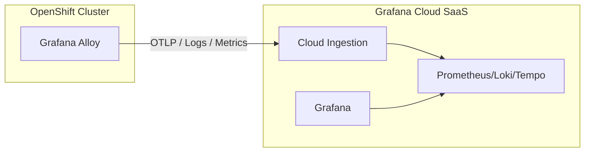
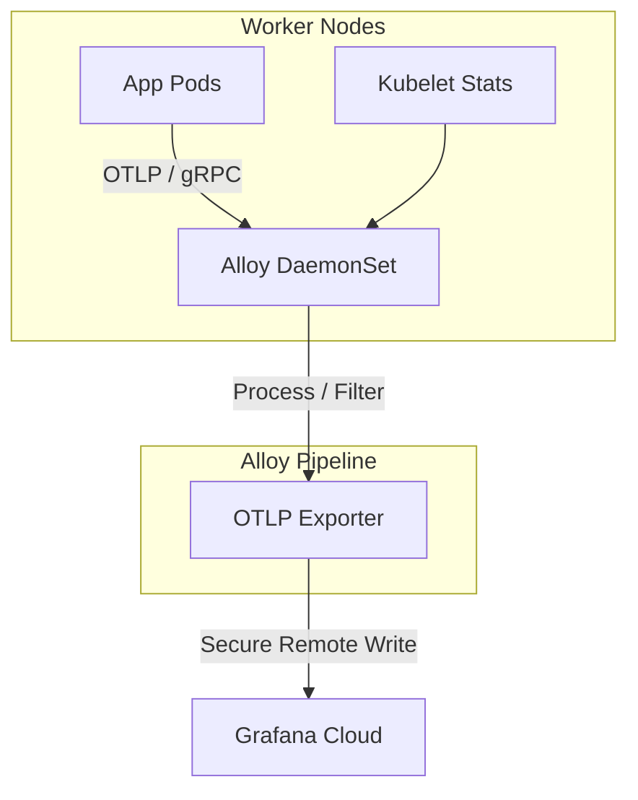
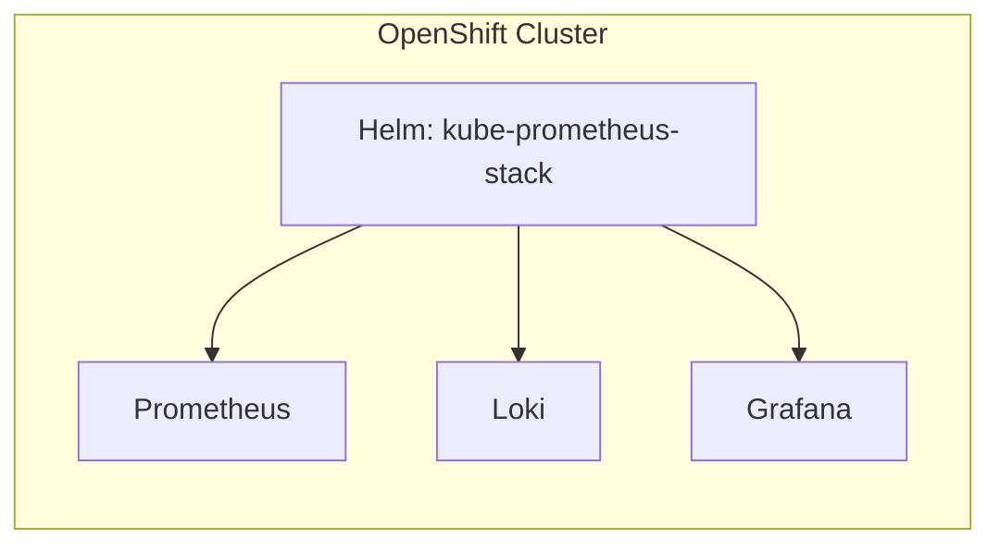
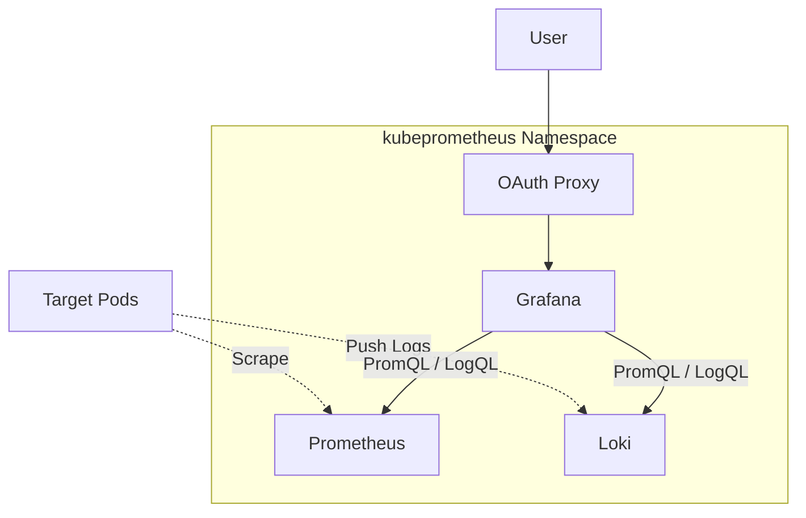
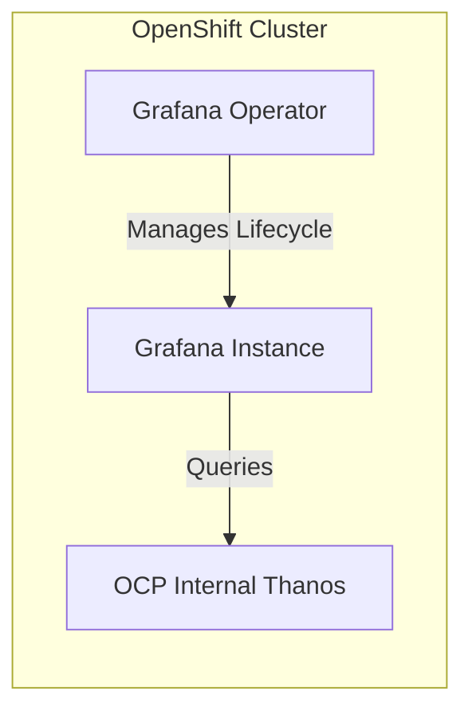
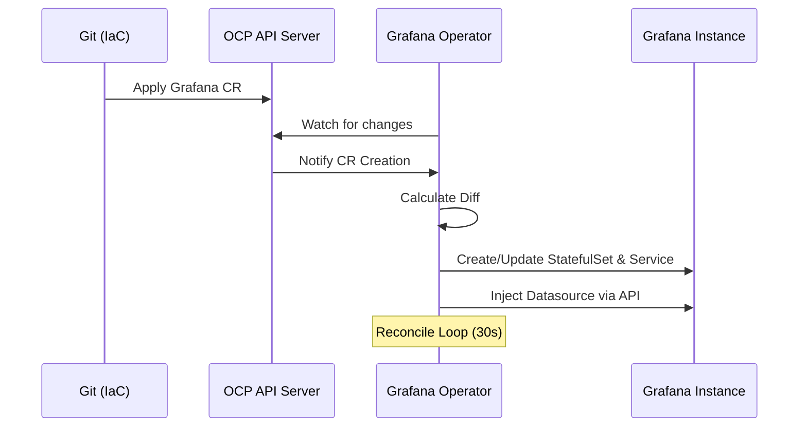
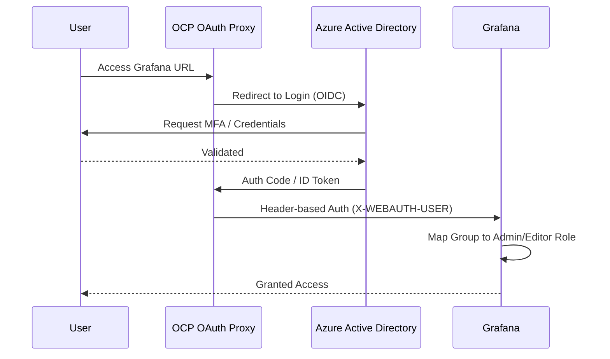
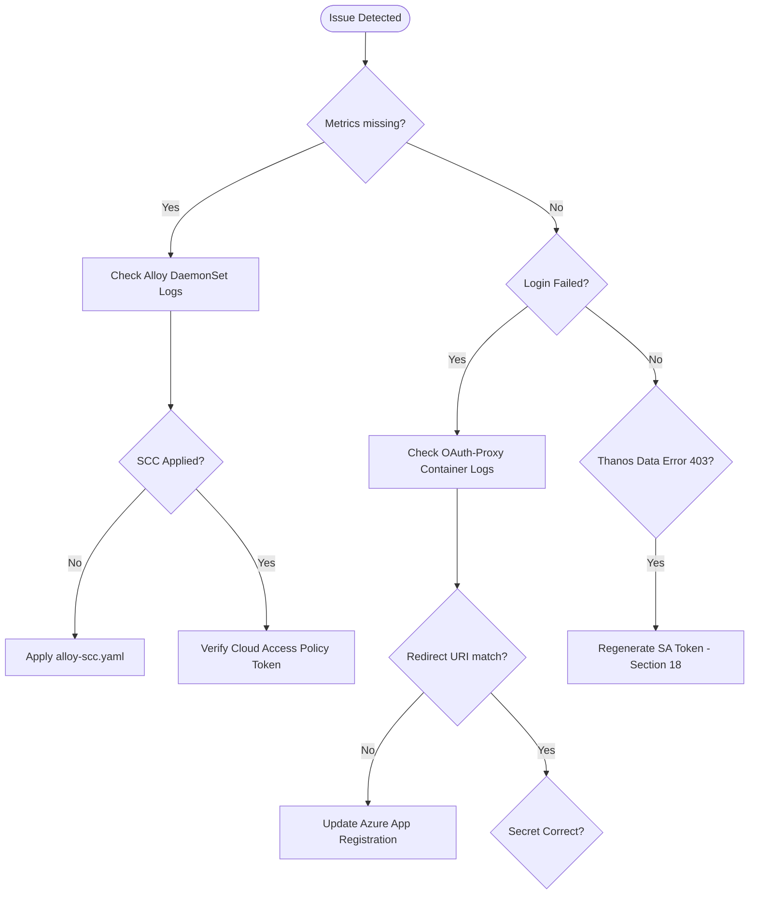

# 📊 Master Engineering Documentation: Grafana Observability on OpenShift

> [!IMPORTANT]
> **Human-Coded / Sin IA**:
> All code and manifests in this repository have been developed manually without AI assistance.
>
> **Spanish Version (Original) / Versión en Español**:
> Este repositorio cuenta con una versión original en español redactada manualmente sin el uso de IA: [README-Spanish.md](README-Spanish.md).
>
> **English Documentation (AI-Enhanced)**:
> This `README.md` (Engineering Guide) and [README-English.md](README-English.md) have been generated and translated using AI, based on the original Spanish documentation. Multimedia resources in the `resources/notebooklm-summaries/` directory were generated using NotebookLM.

---

## 📽️ NotebookLM Multimedia Summaries (AI-Generated)

For a quick and dynamic overview of this repository's content, you can check these materials automatically generated by NotebookLM:

- 🎙️ **Audio Overview (Spanish):** [Resumen Grafana en OpenShift (MP4)](resources/notebooklm-summaries/Grafana_en_OpenShift.mp4)
- 🎙️ **Audio Overview (English):** [Engineering Guide & Deep-Dive (MP4)](resources/notebooklm-summaries/OpenShift_Grafana_Guide.mp4)
- 📄 **Executive Presentation (PDF):** [Engineering deep-dive (PDF)](resources/notebooklm-summaries/OpenShift_Grafana_Engineering.pdf)
- 📊 **Presentation Slides (PPTX):** [Engineering Slides (PPTX)](resources/notebooklm-summaries/OpenShift_Grafana_Engineering.pptx)

---

## 📋 Table of Contents
- [1. Executive Summary](#1-executive-summary)
- [2. Quick Navigation Map](#2-quick-navigation-map)
- [3. Prerequisites and Environment](#3-prerequisites-and-environment)
- [4. Platform Engineering: Object Mapping](#4-platform-engineering-object-mapping)
- [5. Unified Tagging and Discovery Schema](#5-unified-tagging-and-discovery-schema)
- [6. Solution Comparison Matrix](#6-solution-comparison-matrix)
- [7. Architectural Framework](#7-architectural-framework)
- [8. Solution Inventory and Mapping](#8-solution-inventory-and-mapping)
- [9. Solution 1: Grafana Cloud (SaaS)](#9-solution-1-grafana-cloud-saas)
  - [9.1 Architectural Design (HLD and LLD)](#91-architectural-design-hld-and-lld)
  - [9.2 Installation Procedure](#92-installation-procedure)
  - [9.3 Alloy and Collector Configuration](#93-alloy-and-collector-configuration)
  - [9.4 FinOps: Telemetry Optimization](#94-finops-telemetry-optimization)
- [10. Solution 2: kube-prometheus-stack (Community Chart)](#10-solution-2-kube-prometheus-stack-community-chart)
  - [10.1 Architectural Design (HLD and LLD)](#101-architectural-design-hld-and-lld)
  - [10.2 Installation Procedure](#102-installation-procedure)
  - [10.3 AzureAD OAuth Integration Details](#103-azuread-oauth-integration-details)
- [11. Solution 3: Grafana Operator (Native Integration)](#11-solution-3-grafana-operator-native-integration)
  - [11.1 Architectural Design (HLD and LLD)](#111-architectural-design-hld-and-lld)
  - [11.2 Operator Reconciliation Sequence](#112-operator-reconciliation-sequence)
  - [11.3 Installation and Components](#113-installation-and-components)
- [12. Identity and Security: AzureAD OAuth Flow](#12-identity-and-security-azuread-oauth-flow)
- [13. Security Hardening: SCC Analysis](#13-security-hardening-scc-analysis)
- [14. Performance and Resource Profile](#14-performance-and-resource-profile)
- [15. Day 1 and Day 2 Operations Cheat Sheet](#15-day-1-and-day-2-operations-cheat-sheet)
- [16. Troubleshooting Decision Tree](#16-troubleshooting-decision-tree)
- [17. Technical Reference and Resources](#17-technical-reference-and-resources)
- [18. Troubleshooting and FAQ](#18-troubleshooting-and-faq)

---

## 1. Executive Summary
This project implements a multi-tenant, high-availability observability stack using Grafana components. It is tailored for **OpenShift 4.x**, focusing on the transition from the legacy Grafana Agent to the new **Grafana Alloy** and the automation provided by the **Grafana Operator**.

---

## 2. Quick Navigation Map
```text
./
├── solution-3-grafana-operator/      # ⭐️ Recommended Native OpenShift Integration
│   ├── 1-grafana-operator.yaml         # Operator subscription manifest
│   ├── 3-grafana.yaml                  # Grafana Instance and OIDC configuration
│   └── templates/                      # Dashboards and Datasources as Code
├── solution-1-grafana-cloud/         # SaaS Hybrid strategy (Grafana Alloy)
│   ├── metrics.alloy                   # Core telemetry pipeline config
│   └── grafana-cloud.sh                # Automated installer
└── solution-2-kube-prometheus-stack/ # Complete community stack (Air-gapped friendly)
    ├── installer-3.sh                  # AzureAD integrated installer
    └── values-kube-prometheus-stack.yml # Custom Helm values
```

---

## 3. Prerequisites and Environment
- **Cluster**: OpenShift 4.10+ (Tested up to 4.14).
- **Permissions**: `cluster-admin` for SCC creation and Operator subscriptions.
- **Identity**: Azure Portal access for App Registrations.
- **Tools**: `oc` v4.x, `helm` v3.12+, `python3` (for dashboard scripts).

---

## 4. Platform Engineering: Object Mapping
Analysis of Infrastructure as Code (IaC) components and their system functions.

| Component | K8s/OCP Object | Critical Function (Reverse Engineered) |
| :--- | :--- | :--- |
| **Alloy Collector** | `DaemonSet` | Scrapes `kubelet` (port 10250) and `/var/log/pods` via `hostpid` bypass. |
| **Grafana Operator** | `Subscription` | Manages OLM lifecycle; reconciles `Grafana` CRs into `StatefulSet` objects. |
| **OAuth Proxy** | `Sidecar Container` | Injected into Grafana pods; triggers OCP-native auth delegating to AzureAD. |
| **Custom SCC** | `SecurityContextConstraints` | Grants `allowPrivilegedContainer` for eBPF-based socket filtering in Alloy. |
| **Datasource Provisioner**| `Shell Script / API` | Injects long-lived SA tokens into Grafana to bypass 24h token expiry. |

---

## 5. Unified Tagging and Discovery Schema
For Alloy/Prometheus to automatically discover and instrument your applications, they must adhere to this standard.

| Metadata Type | Required Label/Annotation | Description |
| :--- | :--- | :--- |
| **App Name** | `app.kubernetes.io/name` | Used as the `service` tag in Grafana Cloud. |
| **Metric Port** | Port name must be `metrics` | Alloy specifically looks for ports named `metrics` in Service/Pod discovery. |
| **Environment** | `tags.datadoghq.com/env` | (Standardized) Used for multi-tenant environment filtering. |
| **Version** | `app.kubernetes.io/version` | Facilitates Trace/Log correlation via version tagging. |

---

## 6. Solution Comparison Matrix

| Feature | Solution 1: Cloud | Solution 2: Community Chart | Solution 3: Operator |
|---------|-------------------|----------------------------|----------------------|
| **Back-end** | Grafana Cloud (SaaS) | Local Prometheus/Loki | Thanos / Native OCP |
| **Maintenance** | Low (Managed) | High (Self-managed) | Medium (Operator-led) |
| **Cost Profile** | Pay-per-use (SaaS) | Infrastructure only | Low (Reuse OCP data) |
| **OCP Integration** | Medium | Medium | **Very High** |
| **Ideal For** | SaaS-first teams | Air-gapped clusters | Native OCP environments |

---

## 7. Architectural Framework
The project explores three distinct deployment models:
- **Solution 1**: Hybrid model pushing telemetry to Grafana Cloud via Alloy.
- **Solution 2**: Full on-prem stack via the community Helm chart.
- **Solution 3**: On-prem stack managed via Grafana Operator, integrated with OpenShift's internal Thanos/Prometheus.

---

## 8. Solution Inventory and Mapping

| Solution | Path | Primary Backend | Status |
|----------|------|-----------------|--------|
| **Sol 1** | [`solution-1-grafana-cloud/`](./solution-1-grafana-cloud/) | [Grafana Cloud](https://grafana.com) | Validated |
| **Sol 2** | [`solution-2-kube-prometheus-stack/`](./solution-2-kube-prometheus-stack/) | Prometheus/Grafana | Validated |
| **Sol 3** | [`solution-3-grafana-operator/`](./solution-3-grafana-operator/) | Thanos / OCP | **Recommended** |

---

## 9. Solution 1: Grafana Cloud (SaaS)

### 9.1 Architectural Design (HLD and LLD)

**High-Level Architecture (Hybrid SaaS)**:
Alloy acts as the local bridge, concentrating all telemetry before securely forwarding it to the Grafana Cloud backend.

<details>
<summary>Click to view: High-Level Architecture (Hybrid SaaS)</summary>


</details>

**Low-Level Design (Pipeline Flow)**:
Applications send OTLP data to the Alloy DaemonSet, which performs local processing (relabeled, batched) and exports to the cloud.

<details>
<summary>Click to view: Low-Level Design (Pipeline Flow)</summary>


</details>

### 9.2 Installation Procedure
1.  **Namespace**: `oc apply -f namespace.yaml`
2.  **Security**: Apply SCCs to grant necessary privileges to Alloy:
    ```bash
    oc apply -f scc-grafanacloud.yaml
    oc apply -f scc-grafanacloud2.yaml
    ```
3.  **Deployment**: Execute the installation script: `./grafana-cloud.sh`

### 9.3 Alloy and Collector Configuration
Alloy gateway endpoints for applications:
- **OTLP/gRPC**: `http://grafana-alloy.grafana-cloud.svc:4317`
- **Zipkin**: `http://grafana-alloy.grafana-cloud.svc:9411`

### 9.4 FinOps: Telemetry Optimization
Based on `metrics.alloy` engineering:
*   **Metric Dropping**: Automatically discards `container_memory_cache` and `container_threads` to reduce series volume by ~15%.
*   **Relabeling**: Only metrics with `label_keep` are sent to the cloud, ensuring cost control at the source.

---

## 10. Solution 2: kube-prometheus-stack (Community Chart)

### 10.1 Architectural Design (HLD and LLD)

**High-Level Architecture (Self-Managed)**:
A traditional on-premise observability stack where all components (ingestion, storage, and visualization) reside within the OpenShift cluster.

<details>
<summary>Click to view: High-Level Architecture (Self-Managed)</summary>


</details>

**Low-Level Design (Internal Interaction)**:
Prometheus scrapes metrics from targets via ServiceMonitors, while Grafana queries both Prometheus and Loki for unified visualization.

<details>
<summary>Click to view: Low-Level Design (Internal Interaction)</summary>


</details>

### 10.2 Installation Procedure
1.  **Provisioning**: Apply `namespace.yaml` and `scc-kubeprometheus.yaml`.
2.  **Deployment**: Use `./installer-3.sh` for AzureAD integration.

### 10.3 AzureAD OAuth Integration Details
1.  **Redirect URIs**: `https://grafana-kubeprometheus.apps.<cluster>/login/azuread`
2.  **RBAC Mapping**: Azure Groups are mapped to Grafana Roles (Admin/Editor/Viewer) via `X-Forwarded-Groups` header.

---

## 11. Solution 3: Grafana Operator (Native Integration)

### 11.1 Architectural Design (HLD and LLD)

**High-Level Architecture (Operator-Led)**:
Automated lifecycle management of Grafana using Kubernetes-native Custom Resources (CRs), leveraging OpenShift's internal monitoring data.

<details>
<summary>Click to view: High-Level Architecture (Operator-Led)</summary>


</details>

### 11.2 Operator Reconciliation Sequence
How the Operator ensures the desired state is met.

<details>
<summary>Click to view: Operator Reconciliation Sequence</summary>


</details>

### 11.3 Installation and Components
1.  **Operator**: `oc apply -f 1-grafana-operator.yaml`
2.  **Instance**: `oc apply -f 3-grafana.yaml`
3.  **Automation**: `./4-grafana-datasource.sh` imports the Thanos connection.

---

## 12. Identity and Security: AzureAD OAuth Flow
The authentication flow leverages the OpenShift OAuth Proxy as a sidecar to the Grafana instance.

<details>
<summary>Click to view: AzureAD OAuth Flow</summary>


</details>

---

## 13. Security Hardening: SCC Analysis
Deep dive into the custom SecurityContextConstraints provided in this repo.

| Capability | Enabled | Technical Reason |
| :--- | :--- | :--- |
| `allowPrivilegedContainer` | **YES** | Required for Alloy to use `BPF_PROG_TYPE_SOCKET_FILTER`. |
| `allowHostPID` | **YES** | Alloy must map container PIDs to host PIDs for process-level metrics. |
| `allowHostNetwork` | **YES** | Allows collection of host-level network interface statistics. |
| `runAsUser` | `RunAsAny` | Supports legacy images and specific system-level agents. |

---

## 14. Performance and Resource Profile
Based on production-grade limits defined in `values.yaml` and `DatadogAgent` CRs.

| Component | CPU (Req/Lim) | RAM (Req/Lim) | Scaling Factor |
| :--- | :--- | :--- | :--- |
| **Alloy (DaemonSet)** | 250m / 500m | 512Mi / 1Gi | Per Cluster Node |
| **Grafana Instance** | 100m / 200m | 256Mi / 512Mi | High Availability (2 Replicas) |
| **Prometheus (Sol 2)** | 1.0 / 2.0 | 4Gi / 8Gi | Database Volume dependent |

---

## 15. Day 1 and Day 2 Operations Cheat Sheet

**Provisioning (Day 1)**:
*   `oc get subscriptions -n openshift-operators` - Check Operator health.
*   `oc get csv` - Verify Cluster Service Version status.

**Maintenance (Day 2)**:
*   **Token Refresh**: `oc create token grafana-sa --duration=8760h` (Generates a 1-year token for Thanos).
*   **Logs Audit**: `oc logs -l app=grafana -c grafana` - Debugging OAuth handshake.
*   **Alloy Debug**: `oc port-forward alloy-pod 12345:12345` - Access Alloy's internal UI.

---

## 16. Troubleshooting Decision Tree
Use this guide to diagnose connectivity or visibility issues.

<details>
<summary>Click to view: Troubleshooting Decision Tree</summary>


</details>

---

## 17. Technical Reference and Resources
- **Dashboards**: [dotdc/grafana-dashboards-kubernetes](https://github.com/dotdc/grafana-dashboards-kubernetes)
- **Official Releases**: [Grafana 11 News](https://grafana.com/blog/2024/04/09/grafana-11-release-all-the-new-features/)
- **Alloy Config**: Detailed examples in [`solution-1-grafana-cloud/metrics.alloy`](./solution-1-grafana-cloud/metrics.alloy).

---

## 18. Troubleshooting and FAQ

### ❓ Thanos Datasource Error 403 / "Unauthorized"
**Expert Insight**: This is usually due to an expired Service Account Token. Since OCP 4.11, SA tokens are bounded.
**Solution**: Use the `TokenRequest` API to generate a long-lived token (up to 1 year) and update the Grafana Datasource:
```bash
oc create token grafana-instance-sa --duration=$((365*24))h
```

### ❓ Redirect URI mismatch in AzureAD
Ensure your Azure App Registration includes the exact redirect URL provided by the OpenShift Route: `https://<route-url>/login/azuread`.
