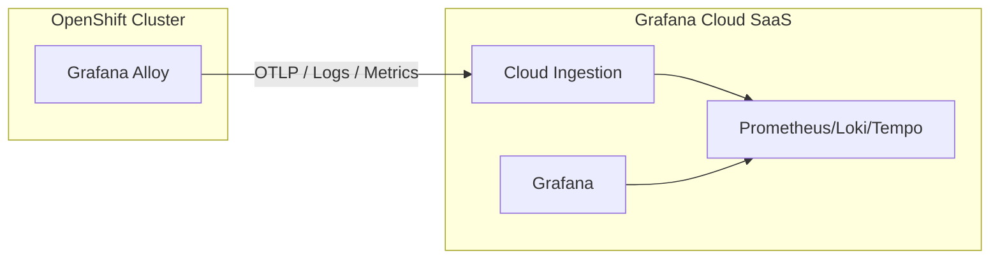
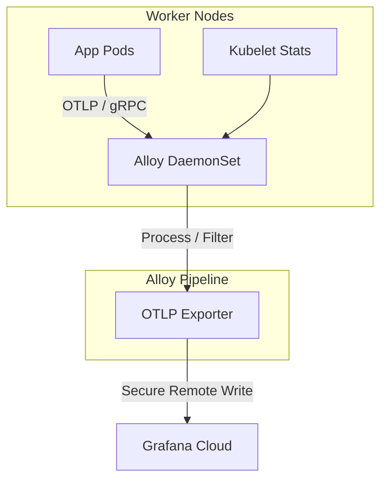
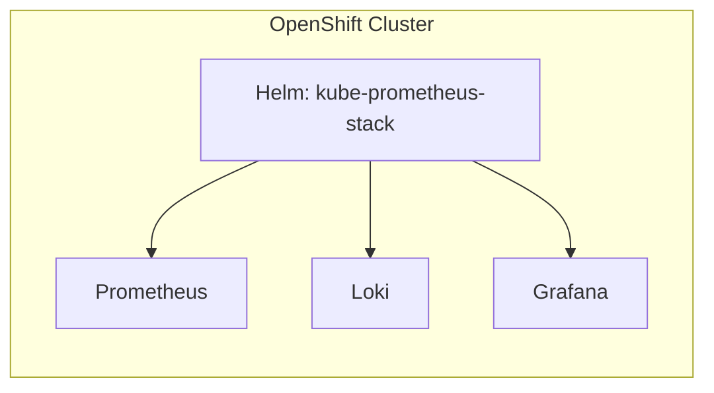
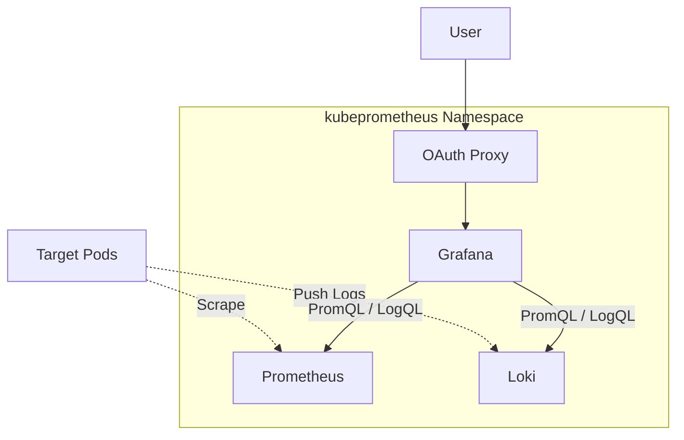
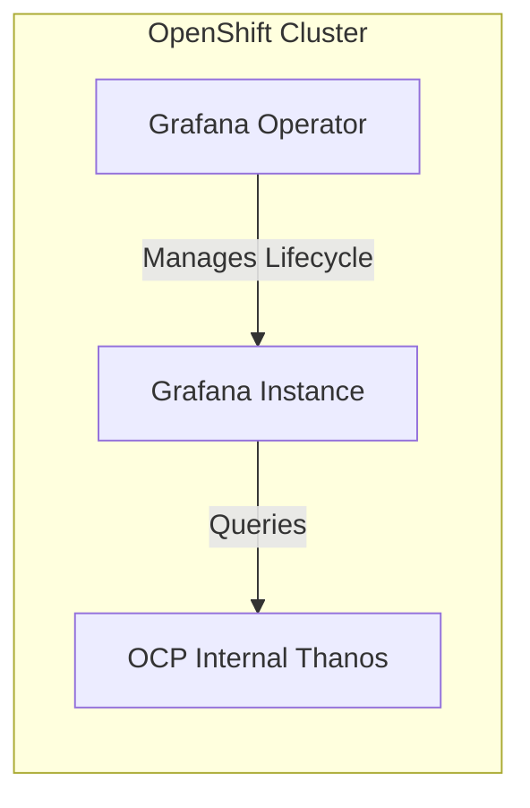
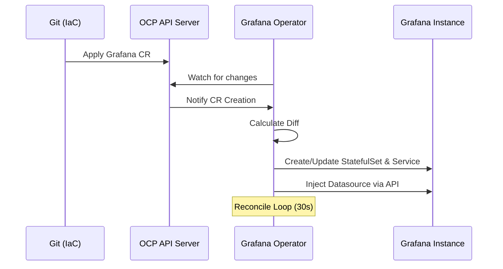
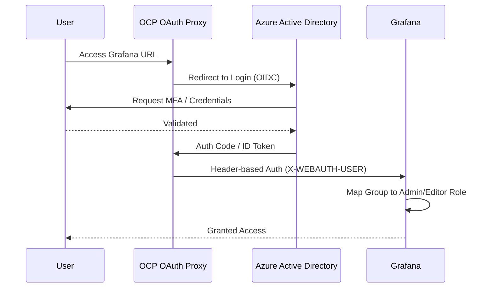
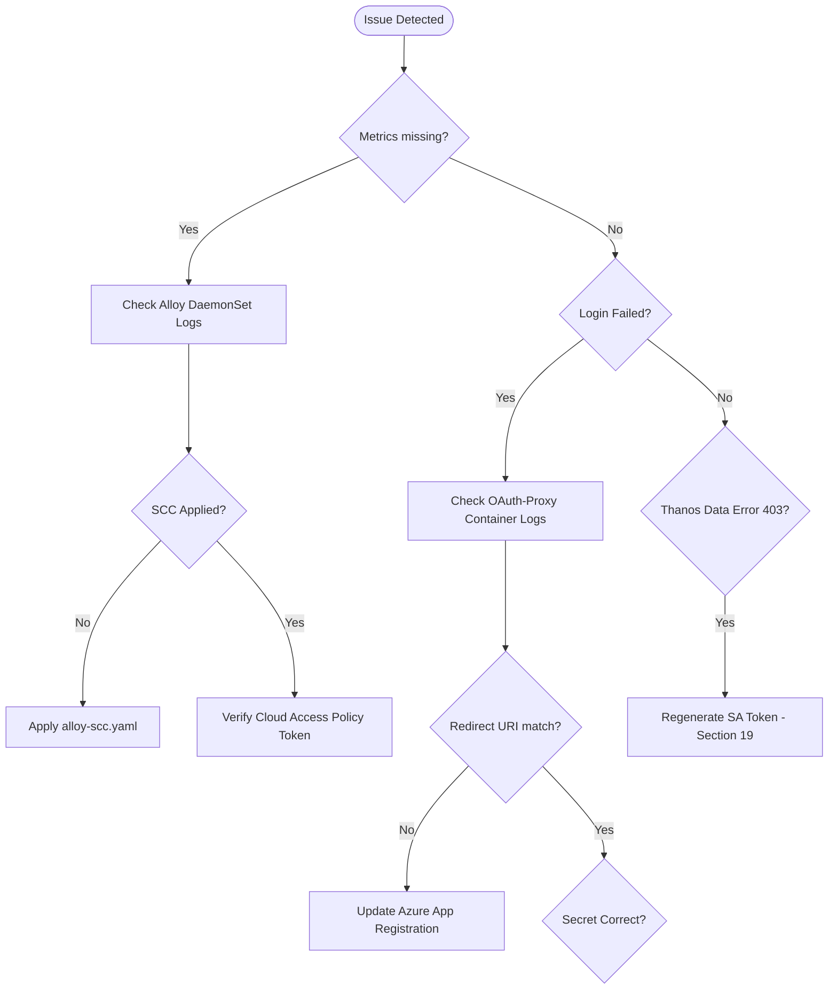
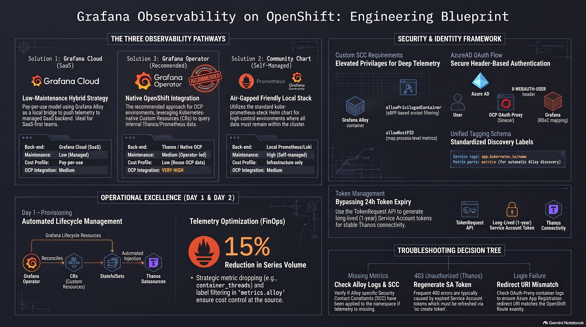

# 📊 Master Engineering Documentation: Grafana Observability on OpenShift

> [!IMPORTANT]
> **Human-Coded / Sin IA**:
> All code and manifests in this repository have been developed manually without AI assistance.
>
> **Spanish Version (Original) / Versión en Español**:
> Este repositorio cuenta con una versión original en español redactada manualmente sin el uso de IA: [README-Spanish.md](README-Spanish.md).
>
> **English Documentation (AI-Enhanced)**:
> This `README.md` (Engineering Guide) and [README-English.md](README-English.md) have been generated and translated using AI, based on the original Spanish documentation. Multimedia resources in the `resources/notebooklm-summaries/` directory were generated using NotebookLM.

---

## 🤖 AI-Generated Summaries & Multimedia (NotebookLM & YouTube)

This repository includes a comprehensive multi-format educational series synthesized with **Gemini NotebookLM** based directly on this repository's code, manifests, and documentation. All videos and shorts are published and freely accessible on YouTube on the [**@nubenetes**](https://youtube.com/@nubenetes) channel.

> [!NOTE]
> **Multilingual Learning Experience**:
> Content features native spoken audio in **English 🇺🇸** and **Spanish 🇪🇸**, and includes automated YouTube subtitles / closed captions (CC) translated into **20+ languages** (French, German, Japanese, Portuguese, Italian, Arabic, Hindi, etc.) for global knowledge sharing.

### 🎬 Full-Length Technical Deep Dives (Videos & Podcasts)

| # | Format | Video / Podcast Title | Category / Domain | Origin Language | Duration | Direct YouTube Link |
|---|:---:|---|---|:---:|:---:|---|
| 1 | 🎙️ **Podcast** | [**Podcast: Grafana Alloy Telemetry Pipelines on OpenShift**](https://www.youtube.com/watch?v=VWO14rXilYk) | Telemetry Pipelines & OTel Masterclass | 🇺🇸 English *(CC)* | `36:02` | [▶️ Listen to Podcast](https://www.youtube.com/watch?v=VWO14rXilYk) |
| 2 | 🎙️ **Podcast** | [**Podcast: Observabilidad en OpenShift con Grafana Alloy**](https://www.youtube.com/watch?v=lHu6K861yDE) | Pipelines OTel y Hardening en OpenShift | 🇪🇸 Español *(CC 20+)* | `15:22` | [▶️ Escuchar Podcast](https://www.youtube.com/watch?v=lHu6K861yDE) |
| 3 | 🎙️ **Podcast** | [**Grafana on OpenShift Guide**](https://www.youtube.com/watch?v=am5ohrxpzfY) | Architecture & Fundamentals | 🇺🇸 English *(CC 20+)* | `8:48` | [▶️ Listen to Podcast](https://www.youtube.com/watch?v=am5ohrxpzfY) |
| 4 | 🎙️ **Podcast** | [**Grafana en OpenShift**](https://www.youtube.com/watch?v=oD0-JjNWL3k) | Arquitectura y Comparativa de Soluciones | 🇪🇸 Español *(CC 20+)* | `8:47` | [▶️ Escuchar Podcast](https://www.youtube.com/watch?v=oD0-JjNWL3k) |
| 5 | 📽️ Video Guide | [**Grafana on OpenShift 2**](https://www.youtube.com/watch?v=EywJm1VdHPk) | Operators, SSO & Dashboards as Code | 🇺🇸 English *(CC 20+)* | `10:04` | [▶️ Watch Video](https://www.youtube.com/watch?v=EywJm1VdHPk) |
| 6 | 📽️ Video Guide | [**Grafana on OpenShift**](https://www.youtube.com/watch?v=cNzOptMoHvk) | Enterprise Observability & Federation | 🇺🇸 English *(CC 20+)* | `8:08` | [▶️ Watch Video](https://www.youtube.com/watch?v=cNzOptMoHvk) |
| 7 | 📽️ Video Guide | [**Grafana en OpenShift  SCC**](https://www.youtube.com/watch?v=sDRG1L3jA40) | Seguridad y Hardening (SCC) | 🇪🇸 Español *(CC 20+)* | `7:25` | [▶️ Ver Vídeo](https://www.youtube.com/watch?v=sDRG1L3jA40) |
| 8 | 📽️ Video Guide | [**Grafana Alloy on OpenShift**](https://www.youtube.com/watch?v=9DnbcMNafjk) | Telemetry Pipelines & OTel Collector | 🇺🇸 English *(CC 20+)* | `6:52` | [▶️ Watch Video](https://www.youtube.com/watch?v=9DnbcMNafjk) |
| 9 | 📽️ Video Guide | [**Grafana Alloy en OpenShift**](https://www.youtube.com/watch?v=hTBl9CXzSWQ) | Pipelines de Métricas y Grafana Cloud | 🇪🇸 Español *(CC 20+)* | `5:44` | [▶️ Ver Vídeo](https://www.youtube.com/watch?v=hTBl9CXzSWQ) |

### ⚡ Topic-Focused Technical Shorts

| # | Short Title | Category | Origin Language | Duration | Direct YouTube Link |
|---|---|---|:---:|:---:|---|
| 1 | [**Architecting Grafana Observability on OpenShift**](https://www.youtube.com/shorts/ff2Lx2hl6Mg) | Architecture & Enterprise Strategy | 🇺🇸 English *(CC 20+)* | `1:07` | [▶️ Watch Short](https://www.youtube.com/shorts/ff2Lx2hl6Mg) |
| 2 | [**Three Ways to Deploy Grafana on OpenShift**](https://www.youtube.com/shorts/Vc1eDO4nJog) | Deployment Strategies & Operators | 🇺🇸 English *(CC 20+)* | `1:26` | [▶️ Watch Short](https://www.youtube.com/shorts/Vc1eDO4nJog) |
| 3 | [**Why Grafana Alloy Needs OpenShift SCCs**](https://www.youtube.com/shorts/6Py5FpPc674) | Security & Platform Engineering | 🇺🇸 English *(CC 20+)* | `1:24` | [▶️ Watch Short](https://www.youtube.com/shorts/6Py5FpPc674) |

*For complete descriptions and the full progressive learning path, see [Section 20: Video Walkthroughs & Architecture References](#20-video-walkthroughs--architecture-references-youtube).*

### 📁 Offline Engineering Artifacts
- 🎙️ **Audio Overview (Spanish):** [Resumen Grafana en OpenShift (MP4)](resources/notebooklm-summaries/Grafana_en_OpenShift.mp4)
- 🎙️ **Audio Overview (English):** [Engineering Guide & Deep-Dive (MP4)](resources/notebooklm-summaries/OpenShift_Grafana_Guide.mp4)
- 📄 **Executive Presentation (PDF):** [Engineering deep-dive (PDF)](resources/notebooklm-summaries/OpenShift_Grafana_Engineering.pdf)
- 📊 **Presentation Slides (PPTX):** [Engineering Slides (PPTX)](resources/notebooklm-summaries/OpenShift_Grafana_Engineering.pptx)

---

## 📋 Table of Contents
- [1. Executive Summary](#1-executive-summary)
- [2. Quick Navigation Map](#2-quick-navigation-map)
- [3. Prerequisites and Environment](#3-prerequisites-and-environment)
- [4. Platform Engineering: Object Mapping](#4-platform-engineering-object-mapping)
- [5. Unified Tagging and Discovery Schema](#5-unified-tagging-and-discovery-schema)
- [6. Solution Comparison Matrix](#6-solution-comparison-matrix)
- [7. Architectural Framework](#7-architectural-framework)
- [8. Solution Inventory and Mapping](#8-solution-inventory-and-mapping)
- [9. Solution 1: Grafana Cloud (SaaS)](#9-solution-1-grafana-cloud-saas)
  - [9.1 Architectural Design (HLD and LLD)](#91-architectural-design-hld-and-lld)
  - [9.2 Installation Procedure](#92-installation-procedure)
  - [9.3 Alloy and Collector Configuration](#93-alloy-and-collector-configuration)
  - [9.4 FinOps: Telemetry Optimization](#94-finops-telemetry-optimization)
- [10. Solution 2: kube-prometheus-stack (Community Chart)](#10-solution-2-kube-prometheus-stack-community-chart)
  - [10.1 Architectural Design (HLD and LLD)](#101-architectural-design-hld-and-lld)
  - [10.2 Installation Procedure](#102-installation-procedure)
  - [10.3 AzureAD OAuth Integration Details](#103-azuread-oauth-integration-details)
- [11. Solution 3: Grafana Operator (Native Integration)](#11-solution-3-grafana-operator-native-integration)
  - [11.1 Architectural Design (HLD and LLD)](#111-architectural-design-hld-and-lld)
  - [11.2 Operator Reconciliation Sequence](#112-operator-reconciliation-sequence)
  - [11.3 Installation and Components](#113-installation-and-components)
- [12. Identity and Security: AzureAD OAuth Flow](#12-identity-and-security-azuread-oauth-flow)
- [13. Security Hardening: SCC Analysis](#13-security-hardening-scc-analysis)
- [14. Performance and Resource Profile](#14-performance-and-resource-profile)
- [15. Day 1 and Day 2 Operations Cheat Sheet](#15-day-1-and-day-2-operations-cheat-sheet)
- [16. Troubleshooting Decision Tree](#16-troubleshooting-decision-tree)
- [17. Technical Reference and Resources](#17-technical-reference-and-resources)
- [18. Technical Infographics: Engineering Blueprints](#18-technical-infographics-engineering-blueprints)
- [19. Troubleshooting and FAQ](#19-troubleshooting-and-faq)
- [20. Video Walkthroughs & Architecture References (YouTube)](#20-video-walkthroughs--architecture-references-youtube)

---

## 1. Executive Summary
This project implements a multi-tenant, high-availability observability stack using Grafana components. It is tailored for **OpenShift 4.x**, focusing on the transition from the legacy Grafana Agent to the new **Grafana Alloy** and the automation provided by the **Grafana Operator**.

---

## 2. Quick Navigation Map

This repository provides three fully functional observability pathways on OpenShift 4.x, alongside security policies, dashboard templates, and architecture blueprints. Use this navigation map to quickly find the appropriate solution, manifests, and configuration scripts.

### 🗺️ Repository Structure Overview

```text
grafana-on-openshift/
├── 📁 solution-3-grafana-operator/      # ⭐️ RECOMMENDED: Cloud-native OpenShift integration (OLM & CRDs)
│   ├── 📄 1-grafana-operator.yaml         # OLM Subscription & OperatorGroup for Grafana Operator
│   ├── 📜 2-grafana-oauth.sh              # OpenShift OAuth client & Azure AD federation setup script
│   ├── 📄 3-grafana.yaml                  # Primary Grafana CR (instance sizing, OAuth proxy sidecar, storage)
│   ├── 📜 4-grafana-datasource.sh         # Script provisioning 1-year SA token & Thanos datasource
│   ├── 📁 templates/                      # Dashboards & Datasources as Code (Declarative CRDs)
│   │   ├── 📄 5-grafana-datasource.yaml   # GrafanaDatasource CR targeting in-cluster Thanos Querier
│   │   ├── 📄 6-imported-dashboards.yaml  # GrafanaDashboard CR for cluster & namespace infrastructure
│   │   └── 📄 7-app-dashboards.yaml       # GrafanaDashboard CR for microservice & workload metrics
│   ├── 📁 tests/                          # Alternative & multi-instance test manifests
│   │   ├── 📄 grafana2.yaml               # Alternative Grafana CR definition
│   │   └── 📄 grafana-operator2.yaml      # Alternative Operator subscription
│   ├── 📘 README.md                       # Comprehensive Grafana Operator deployment & hardening guide
│   └── 📕 README-Spanish.md               # Guía completa de despliegue del Operator en español
│
├── 📁 solution-1-grafana-cloud/         # ☁️ HYBRID SAAS: Telemetry pipelines with Grafana Alloy (OTel-native)
│   ├── 📄 metrics.alloy                   # Declarative pipeline for kubelet scraping & FinOps metric dropping
│   ├── 📄 logs.alloy                      # Pipeline for tailing container logs from /var/log/pods
│   ├── 📄 events.alloy                    # Pipeline for streaming Kubernetes cluster events to Loki
│   ├── 📄 profiles.alloy                  # Continuous profiling pipeline (Pyroscope / Cloud Profiles)
│   ├── 📄 scc-grafanacloud.yaml           # Custom SCC granting Alloy allowHostPID & privileged eBPF rights
│   ├── 📄 scc-grafanacloud2.yaml          # Alternative SCC configuration variant
│   ├── 📄 values.yaml / values2.yaml      # Helm values for deploying Grafana Alloy DaemonSet on OpenShift
│   ├── 📄 namespace.yaml                  # Dedicated namespace manifest (grafana-alloy)
│   ├── 📜 grafana-cloud.sh / *.sh         # Automated installation & verification shell scripts
│   ├── 📘 README.md                       # Complete guide for configuring Grafana Alloy on OpenShift
│   └── 📕 README-Spanish.md               # Guía completa de Grafana Alloy en español
│
├── 📁 solution-2-kube-prometheus-stack/ # 🔒 AIR-GAPPED / LOCAL: Self-hosted community monitoring stack
│   ├── 📄 values-kube-prometheus-stack.yml # Comprehensive Helm values for Prometheus, Alertmanager & Grafana
│   ├── 📄 scc-kubeprometheus.yaml         # Custom SCC for Prometheus node-exporter & storage mounts
│   ├── 📄 namespace.yaml                  # Dedicated namespace manifest (monitoring)
│   ├── 📁 installer-1/                    # Baseline community installer & configuration
│   │   ├── 📜 installer-1.sh              # Phase 1 deployment script
│   │   └── 📄 values-kube-prometheus-stack.yml # Values file for Phase 1
│   ├── 📜 installer-2.sh                  # Phase 2 installer script with route and storage configurations
│   ├── 📜 installer-3.sh                  # Phase 3 installer script with Azure AD OAuth federation
│   ├── 📁 templates/                      # Ingress & dashboard templates
│   │   ├── 📄 grafana-ingress.yml         # OpenShift Route / Ingress definition
│   │   ├── 📄 grafana-dashboards-kubernetes.yaml # Pre-packaged Kubernetes cluster dashboards
│   │   └── 📄 security-context-constraints.yaml # SCC template
│   ├── 📄 output.yaml / output-custom.yaml # Rendered Helm manifests for air-gapped / offline deployments
│   ├── 📘 README.md                       # Self-hosted stack installation and troubleshooting guide
│   └── 📕 README-Spanish.md               # Guía de la pila autogestionada en español
│
├── 📁 resources/infographics/           # 📐 ARCHITECTURE BLUEPRINTS & INFOGRAPHICS
│   ├── 🖼️ Platform_Observability_Engineering_Blueprint.png # Master engineering blueprint (Pathways, SCC, OAuth)
│   ├── 🖼️ Grafana_Multi-Solution_Observability_Deployment_Guide.png # Multi-solution deployment flow
│   ├── 🖼️ Grafana_Observability_Platform_Integration_Blueprint.png # Platform integration architecture
│   └── 🖼️ Grafana_Observability_Solution_Comparison_Guide.png # Cost, security & operational comparison matrix
│
└── 📁 resources/notebooklm-summaries/   # 🎓 MULTIMEDIA DEEP DIVES & PRESENTATIONS
    ├── 📊 OpenShift_Grafana_Engineering.pdf  # Comprehensive architecture deep-dive deck (PDF)
    ├── 📊 OpenShift_Grafana_Engineering.pptx # Editable engineering presentation slides (PPTX)
    ├── 📽️ OpenShift_Grafana_Guide.mp4       # Video walkthrough (English narration)
    └── 📽️ Grafana_en_OpenShift.mp4           # Video walkthrough (Spanish narration)
```

### 🧭 Detailed Component Breakdown & Directory Roles

| Directory / Component | Architectural Role | Key Deliverables & Manifests | Recommended When... |
| :--- | :--- | :--- | :--- |
| [**`solution-3-grafana-operator/`**](solution-3-grafana-operator/) | **Native OpenShift Integration (Recommended)** | [`1-grafana-operator.yaml`](solution-3-grafana-operator/1-grafana-operator.yaml)<br/>[`3-grafana.yaml`](solution-3-grafana-operator/3-grafana.yaml)<br/>[`templates/`](solution-3-grafana-operator/templates/) | You want an OLM-managed Grafana instance, native integration with OpenShift's built-in Thanos/Prometheus monitoring stack, Azure AD OAuth with OpenShift OAuth proxy sidecars, and Dashboards/Datasources managed as Code via CRDs. |
| [**`solution-1-grafana-cloud/`**](solution-1-grafana-cloud/) | **Hybrid SaaS Observability (Grafana Alloy)** | [`metrics.alloy`](solution-1-grafana-cloud/metrics.alloy)<br/>[`logs.alloy`](solution-1-grafana-cloud/logs.alloy)<br/>[`scc-grafanacloud.yaml`](solution-1-grafana-cloud/scc-grafanacloud.yaml) | You leverage Grafana Cloud (SaaS) and need an ultra-modern, OTel-compatible collector (`Grafana Alloy`) running as a DaemonSet to harvest kubelet metrics (port 10250), container logs, and cluster events with source-level FinOps metric filtering. |
| [**`solution-2-kube-prometheus-stack/`**](solution-2-kube-prometheus-stack/) | **Air-Gapped / Self-Hosted Community Stack** | [`values-kube-prometheus-stack.yml`](solution-2-kube-prometheus-stack/values-kube-prometheus-stack.yml)<br/>[`installer-3.sh`](solution-2-kube-prometheus-stack/installer-3.sh)<br/>[`scc-kubeprometheus.yaml`](solution-2-kube-prometheus-stack/scc-kubeprometheus.yaml) | You operate in strict air-gapped, sovereign, or highly regulated environments where telemetry cannot leave the cluster, and you want an independent Prometheus, Alertmanager, and Grafana stack decoupled from OpenShift platform monitoring. |
| [**`resources/infographics/`**](resources/infographics/) | **High-Resolution Engineering Blueprints** | [`Platform_Observability_Engineering_Blueprint.png`](resources/infographics/Platform_Observability_Engineering_Blueprint.png)<br/>Deployment & Comparison Guides | You need detailed visual architectures covering identity delegation (Azure AD $\rightarrow$ OAuth proxy), custom SCC privilege requirements (`allowHostPID`), and FinOps telemetry reduction for design reviews and audits. |
| [**`resources/notebooklm-summaries/`**](resources/notebooklm-summaries/) | **Executive Presentations & Video Guides** | Engineering PDF & PPTX Decks<br/>MP4 Video Walkthroughs | You need ready-to-deliver architectural presentation slides for stakeholders or multimedia walkthroughs summarizing the three deployment pathways. |

### 🚀 Fast-Track Decision Guide: "Which Path Should I Choose?"

- 🟢 **"I want to visualize OpenShift metrics using GitOps and avoid paying for SaaS storage"**  
  $\rightarrow$ Go straight to [**`solution-3-grafana-operator/`**](solution-3-grafana-operator/). Subscribe to the Grafana Operator, configure OpenShift OAuth/Azure AD, and apply the `GrafanaDatasource` pointing to Thanos Querier.
- 🟡 **"We use Grafana Cloud and need to collect metrics, logs, and traces from OpenShift"**  
  $\rightarrow$ Go to [**`solution-1-grafana-cloud/`**](solution-1-grafana-cloud/). Apply the custom SCC (`scc-grafanacloud.yaml`), tune your metric dropping in `metrics.alloy`, and deploy the Alloy DaemonSet via Helm.
- 🔴 **"We are air-gapped or require a completely independent, self-contained Prometheus/Grafana stack"**  
  $\rightarrow$ Go to [**`solution-2-kube-prometheus-stack/`**](solution-2-kube-prometheus-stack/). Run `installer-3.sh` or deploy via Helm with `values-kube-prometheus-stack.yml`.
- 🟣 **"I need architectural diagrams or slides for my platform team"**  
  $\rightarrow$ Check the [**Technical Infographics**](#18-technical-infographics-engineering-blueprints) in Section 18, visual assets in [**`resources/infographics/`**](resources/infographics/), and executive slide decks in [**`resources/notebooklm-summaries/`**](resources/notebooklm-summaries/).

---

## 3. Prerequisites and Environment
- **Cluster**: OpenShift 4.10+ (Tested up to 4.14).
- **Permissions**: `cluster-admin` for SCC creation and Operator subscriptions.
- **Identity**: Azure Portal access for App Registrations.
- **Tools**: `oc` v4.x, `helm` v3.12+, `python3` (for dashboard scripts).

---

## 4. Platform Engineering: Object Mapping
Analysis of Infrastructure as Code (IaC) components and their system functions.

| Component | K8s/OCP Object | Critical Function (Reverse Engineered) |
| :--- | :--- | :--- |
| **Alloy Collector** | `DaemonSet` | Scrapes `kubelet` (port 10250) and `/var/log/pods` via `hostpid` bypass. |
| **Grafana Operator** | `Subscription` | Manages OLM lifecycle; reconciles `Grafana` CRs into `StatefulSet` objects. |
| **OAuth Proxy** | `Sidecar Container` | Injected into Grafana pods; triggers OCP-native auth delegating to AzureAD. |
| **Custom SCC** | `SecurityContextConstraints` | Grants `allowPrivilegedContainer` for eBPF-based socket filtering in Alloy. |
| **Datasource Provisioner**| `Shell Script / API` | Injects long-lived SA tokens into Grafana to bypass 24h token expiry. |

---

## 5. Unified Tagging and Discovery Schema
For Alloy/Prometheus to automatically discover and instrument your applications, they must adhere to this standard.

| Metadata Type | Required Label/Annotation | Description |
| :--- | :--- | :--- |
| **App Name** | `app.kubernetes.io/name` | Used as the `service` tag in Grafana Cloud. |
| **Metric Port** | Port name must be `metrics` | Alloy specifically looks for ports named `metrics` in Service/Pod discovery. |
| **Environment** | `tags.datadoghq.com/env` | (Standardized) Used for multi-tenant environment filtering. |
| **Version** | `app.kubernetes.io/version` | Facilitates Trace/Log correlation via version tagging. |

---

## 6. Solution Comparison Matrix

| Feature | Solution 1: Cloud | Solution 2: Community Chart | Solution 3: Operator |
|---------|-------------------|----------------------------|----------------------|
| **Back-end** | Grafana Cloud (SaaS) | Local Prometheus/Loki | Thanos / Native OCP |
| **Maintenance** | Low (Managed) | High (Self-managed) | Medium (Operator-led) |
| **Cost Profile** | Pay-per-use (SaaS) | Infrastructure only | Low (Reuse OCP data) |
| **OCP Integration** | Medium | Medium | **Very High** |
| **Ideal For** | SaaS-first teams | Air-gapped clusters | Native OCP environments |

---

## 7. Architectural Framework
The project explores three distinct deployment models:
- **Solution 1**: Hybrid model pushing telemetry to Grafana Cloud via Alloy.
- **Solution 2**: Full on-prem stack via the community Helm chart.
- **Solution 3**: On-prem stack managed via Grafana Operator, integrated with OpenShift's internal Thanos/Prometheus.

---

## 8. Solution Inventory and Mapping

| Solution | Path | Primary Backend | Status |
|----------|------|-----------------|--------|
| **Sol 1** | [`solution-1-grafana-cloud/`](./solution-1-grafana-cloud/) | [Grafana Cloud](https://grafana.com) | Validated |
| **Sol 2** | [`solution-2-kube-prometheus-stack/`](./solution-2-kube-prometheus-stack/) | Prometheus/Grafana | Validated |
| **Sol 3** | [`solution-3-grafana-operator/`](./solution-3-grafana-operator/) | Thanos / OCP | **Recommended** |

---

## 9. Solution 1: Grafana Cloud (SaaS)

### 9.1 Architectural Design (HLD and LLD)

**High-Level Architecture (Hybrid SaaS)**:
Alloy acts as the local bridge, concentrating all telemetry before securely forwarding it to the Grafana Cloud backend.

<details>
<summary>Click to view: High-Level Architecture (Hybrid SaaS)</summary>


```mermaid
graph LR
    subgraph OCP [OpenShift Cluster]
        direction TB
        Alloy[Grafana Alloy]
    end
    subgraph Cloud [Grafana Cloud SaaS]
        Ingestion[Cloud Ingestion]
        G[Grafana]
        P[Prometheus/Loki/Tempo]
    end
    Alloy -->|OTLP / Logs / Metrics| Ingestion
    Ingestion --> P
    G --> P
```
</details>

**Low-Level Design (Pipeline Flow)**:
Applications send OTLP data to the Alloy DaemonSet, which performs local processing (relabeled, batched) and exports to the cloud.

<details>
<summary>Click to view: Low-Level Design (Pipeline Flow)</summary>


```mermaid
graph TD
    subgraph Nodes [Worker Nodes]
        App[App Pods] -->|OTLP / gRPC| AlloyDS[Alloy DaemonSet]
        Kubelet[Kubelet Stats] --> AlloyDS
    end
    subgraph Pipelines [Alloy Pipeline]
        AlloyDS -->|Process / Filter| OTLPOut[OTLP Exporter]
    end
    OTLPOut -->|Secure Remote Write| GCloud[Grafana Cloud]
```
</details>

### 9.2 Installation Procedure
1.  **Namespace**: `oc apply -f namespace.yaml`
2.  **Security**: Apply SCCs to grant necessary privileges to Alloy:
    ```bash
    oc apply -f scc-grafanacloud.yaml
    oc apply -f scc-grafanacloud2.yaml
    ```
3.  **Deployment**: Execute the installation script: `./grafana-cloud.sh`

### 9.3 Alloy and Collector Configuration
Alloy gateway endpoints for applications:
- **OTLP/gRPC**: `http://grafana-alloy.grafana-cloud.svc:4317`
- **Zipkin**: `http://grafana-alloy.grafana-cloud.svc:9411`

### 9.4 FinOps: Telemetry Optimization
Based on `metrics.alloy` engineering:
*   **Metric Dropping**: Automatically discards `container_memory_cache` and `container_threads` to reduce series volume by ~15%.
*   **Relabeling**: Only metrics with `label_keep` are sent to the cloud, ensuring cost control at the source.

---

## 10. Solution 2: kube-prometheus-stack (Community Chart)

### 10.1 Architectural Design (HLD and LLD)

**High-Level Architecture (Self-Managed)**:
A traditional on-premise observability stack where all components (ingestion, storage, and visualization) reside within the OpenShift cluster.

<details>
<summary>Click to view: High-Level Architecture (Self-Managed)</summary>


```mermaid
graph LR
    subgraph OCP [OpenShift Cluster]
        direction TB
        H[Helm: kube-prometheus-stack]
        P[Prometheus]
        L[Loki]
        G[Grafana]
    end
    H --> P & L & G
```
</details>

**Low-Level Design (Internal Interaction)**:
Prometheus scrapes metrics from targets via ServiceMonitors, while Grafana queries both Prometheus and Loki for unified visualization.

<details>
<summary>Click to view: Low-Level Design (Internal Interaction)</summary>


```mermaid
graph TD
    subgraph Monitoring [kubeprometheus Namespace]
        P[Prometheus]
        L[Loki]
        G[Grafana]
        Proxy[OAuth Proxy]
    end
    App[Target Pods] -.->|Scrape| P
    App -.->|Push Logs| L
    User[User] --> Proxy --> G
    G -->|PromQL / LogQL| P & L
```
</details>

### 10.2 Installation Procedure
1.  **Provisioning**: Apply `namespace.yaml` and `scc-kubeprometheus.yaml`.
2.  **Deployment**: Use `./installer-3.sh` for AzureAD integration.

### 10.3 AzureAD OAuth Integration Details
1.  **Redirect URIs**: `https://grafana-kubeprometheus.apps.<cluster>/login/azuread`
2.  **RBAC Mapping**: Azure Groups are mapped to Grafana Roles (Admin/Editor/Viewer) via `X-Forwarded-Groups` header.

---

## 11. Solution 3: Grafana Operator (Native Integration)

### 11.1 Architectural Design (HLD and LLD)

**High-Level Architecture (Operator-Led)**:
Automated lifecycle management of Grafana using Kubernetes-native Custom Resources (CRs), leveraging OpenShift's internal monitoring data.

<details>
<summary>Click to view: High-Level Architecture (Operator-Led)</summary>


```mermaid
graph LR
    subgraph OCP [OpenShift Cluster]
        direction TB
        Op[Grafana Operator]
        GI[Grafana Instance]
        Thanos[OCP Internal Thanos]
    end
    Op -->|Manages Lifecycle| GI
    GI -->|Queries| Thanos
```
</details>

### 11.2 Operator Reconciliation Sequence
How the Operator ensures the desired state is met.

<details>
<summary>Click to view: Operator Reconciliation Sequence</summary>


```mermaid
sequenceDiagram
    participant Git as Git (IaC)
    participant OCP as OCP API Server
    participant Op as Grafana Operator
    participant GI as Grafana Instance
    
    Git->>OCP: Apply Grafana CR
    Op->>OCP: Watch for changes
    OCP->>Op: Notify CR Creation
    Op->>Op: Calculate Diff
    Op->>GI: Create/Update StatefulSet & Service
    Op->>GI: Inject Datasource via API
    Note over Op: Reconcile Loop (30s)
```
</details>

### 11.3 Installation and Components
1.  **Operator**: `oc apply -f 1-grafana-operator.yaml`
2.  **Instance**: `oc apply -f 3-grafana.yaml`
3.  **Automation**: `./4-grafana-datasource.sh` imports the Thanos connection.

---

## 12. Identity and Security: AzureAD OAuth Flow
The authentication flow leverages the OpenShift OAuth Proxy as a sidecar to the Grafana instance.

<details>
<summary>Click to view: AzureAD OAuth Flow</summary>


```mermaid
sequenceDiagram
    participant User
    participant Proxy as OCP OAuth Proxy
    participant AAD as Azure Active Directory
    participant Grafana
    
    User->>Proxy: Access Grafana URL
    Proxy->>AAD: Redirect to Login (OIDC)
    AAD->>User: Request MFA / Credentials
    User-->>AAD: Validated
    AAD->>Proxy: Auth Code / ID Token
    Proxy->>Grafana: Header-based Auth (X-WEBAUTH-USER)
    Grafana->>Grafana: Map Group to Admin/Editor Role
    Grafana-->>User: Granted Access
```
</details>

---

## 13. Security Hardening: SCC Analysis
Deep dive into the custom SecurityContextConstraints provided in this repo.

| Capability | Enabled | Technical Reason |
| :--- | :--- | :--- |
| `allowPrivilegedContainer` | **YES** | Required for Alloy to use `BPF_PROG_TYPE_SOCKET_FILTER`. |
| `allowHostPID` | **YES** | Alloy must map container PIDs to host PIDs for process-level metrics. |
| `allowHostNetwork` | **YES** | Allows collection of host-level network interface statistics. |
| `runAsUser` | `RunAsAny` | Supports legacy images and specific system-level agents. |

---

## 14. Performance and Resource Profile
Based on production-grade limits defined in `values.yaml` and `DatadogAgent` CRs.

| Component | CPU (Req/Lim) | RAM (Req/Lim) | Scaling Factor |
| :--- | :--- | :--- | :--- |
| **Alloy (DaemonSet)** | 250m / 500m | 512Mi / 1Gi | Per Cluster Node |
| **Grafana Instance** | 100m / 200m | 256Mi / 512Mi | High Availability (2 Replicas) |
| **Prometheus (Sol 2)** | 1.0 / 2.0 | 4Gi / 8Gi | Database Volume dependent |

---

## 15. Day 1 and Day 2 Operations Cheat Sheet

**Provisioning (Day 1)**:
*   `oc get subscriptions -n openshift-operators` - Check Operator health.
*   `oc get csv` - Verify Cluster Service Version status.

**Maintenance (Day 2)**:
*   **Token Refresh**: `oc create token grafana-sa --duration=8760h` (Generates a 1-year token for Thanos).
*   **Logs Audit**: `oc logs -l app=grafana -c grafana` - Debugging OAuth handshake.
*   **Alloy Debug**: `oc port-forward alloy-pod 12345:12345` - Access Alloy's internal UI.

---

## 16. Troubleshooting Decision Tree
Use this guide to diagnose connectivity or visibility issues.

<details>
<summary>Click to view: Troubleshooting Decision Tree</summary>


```mermaid
flowchart TD
    Start([Issue Detected]) --> Metrics?{Metrics missing?}
    Metrics? -- Yes --> AlloyLogs[Check Alloy DaemonSet Logs]
    AlloyLogs --> SCC{SCC Applied?}
    SCC -- No --> ApplySCC[Apply alloy-scc.yaml]
    SCC -- Yes --> AuthCloud[Verify Cloud Access Policy Token]
    
    Metrics? -- No --> Login?{Login Failed?}
    Login? -- Yes --> ProxyLogs[Check OAuth-Proxy Container Logs]
    ProxyLogs --> Redirect{Redirect URI match?}
    Redirect -- No --> AzureAD[Update Azure App Registration]
    Redirect -- Yes --> Secret{Secret Correct?}
    
    Login? -- No --> Datasource?{Thanos Data Error 403?}
    Datasource? -- Yes --> SAToken[Regenerate SA Token - Section 19]
```
</details>

---

## 17. Technical Reference and Resources
- **Dashboards**: [dotdc/grafana-dashboards-kubernetes](https://github.com/dotdc/grafana-dashboards-kubernetes)
- **Official Releases**: [Grafana 11 News](https://grafana.com/blog/2024/04/09/grafana-11-release-all-the-new-features/)
- **Alloy Config**: Detailed examples in [`solution-1-grafana-cloud/metrics.alloy`](./solution-1-grafana-cloud/metrics.alloy).

---

## 18. Technical Infographics: Engineering Blueprints

High-resolution visual guides for architecture, deployment patterns, and solution comparison.

<details open>
<summary>📊 <strong>View Architecture and Deployment Infographics (Click to expand / collapse)</strong></summary>

### 📐 Grafana Observability on OpenShift: Engineering Blueprint


#### 🔍 Blueprint Architecture & Technical Breakdown:
- **The Three Observability Pathways**:
  - **Solution 1: Grafana Cloud (SaaS)**:
    - **Strategy**: Low-maintenance hybrid cloud model leveraging Grafana Alloy as a lightweight, in-cluster bridge to push logs, metrics, and traces to a fully managed SaaS backend.
    - **Backend & Target**: Grafana Cloud (Managed). Ideal for SaaS-first engineering teams aiming to offload backend storage, scaling, and cluster maintenance.
    - **Trade-offs**: Low operational maintenance, pay-per-use consumption cost profile, medium OpenShift integration.
  - **Solution 3: Grafana Operator (Recommended)**:
    - **Strategy**: Cloud-native OpenShift integration managed via Operator Lifecycle Manager (OLM). Enables declarative GitOps management using Kubernetes Custom Resource Definitions (CRDs: `Grafana`, `GrafanaDashboard`, `GrafanaDatasource`).
    - **Backend & Target**: OpenShift in-cluster Prometheus and Thanos stack. Directly queries platform-level metrics with zero duplicate storage footprint.
    - **Trade-offs**: Medium maintenance (automated operator reconciliation), lowest cost profile (reuses existing platform data), highest degree of OpenShift-native integration.
  - **Solution 2: Community Chart / kube-prometheus-stack (Self-Managed)**:
    - **Strategy**: Air-gapped and high-control local stack deployed via standard Helm charts for environments where all data and infrastructure must stay strictly within the cluster boundary.
    - **Backend & Target**: Self-hosted Prometheus, Thanos, and Loki instances running on dedicated worker nodes.
    - **Trade-offs**: High maintenance overhead (manual upgrades, storage lifecycle, and scaling), infrastructure-only cost profile, medium OpenShift integration.
- **Security & Identity Framework**:
  - **Custom SCC Requirements**:
    - Grants elevated privileges required for deep telemetry collection: `allowHostPID: true` and `allowPrivilegedContainer: true` for eBPF socket filtering and network diagnostics.
    - Mounts host paths (`/var/log/pods`) and enables scraping the node kubelet directly on port `10250` for real-time container metrics.
  - **Azure AD (Entra ID) OAuth Flow**:
    - **Authentication Chain**: User Access Request $\rightarrow$ Azure AD (Identity Provider) $\rightarrow$ OpenShift OAuth Proxy Sidecar container $\rightarrow$ Injected `X-WEBAUTH-USER` header $\rightarrow$ Grafana instance container.
    - **Role Mapping & RBAC**: Transparently maps enterprise Azure AD group memberships to internal Grafana RBAC roles (Viewer, Editor, Admin) without exposing raw credentials.
  - **Unified Tagging Schema**:
    - **Standardized Discovery Labels**: Enforces uniform service tagging across all workloads using `app.kubernetes.io/name`.
    - **Telemetry Target Port**: Discovers scraping endpoints automatically using standardized metric port names (`metrics`) via Grafana Alloy discovery rules.
  - **Token Management (Bypassing 24h Token Expiry)**:
    - **Problem**: Default OpenShift service account tokens expire after 24 hours in OCP 4.11+, leading to unexpected HTTP `403 Unauthorized` errors when Grafana queries Thanos.
    - **Solution**: Leverages the Kubernetes `TokenRequest` API to generate long-lived (1-year) bound Service Account tokens (`oc create token grafana-instance-sa --duration=8760h`) for continuous, uninterrupted telemetry datasource access.
- **Operational Excellence (Day 1 & Day 2)**:
  - **Day 1 Provisioning & Lifecycle Automation**:
    - The Grafana Operator continuously reconciles Custom Resources (CRs), automatically provisioning and reconfiguring Grafana StatefulSets, datasources, and dashboard injection configs in response to GitOps commits.
  - **Day 2 Telemetry Optimization & FinOps**:
    - **Series Volume Reduction**: Implements strategic metric dropping (e.g., dropping noisy `container_threads` metrics) directly within `metrics.alloy`.
    - **Label Filtering**: Enforces source-level label filtering and metric aggregation in Grafana Alloy before sending data to Thanos or Grafana Cloud, eliminating unnecessary series churn and controlling storage costs.
- **Troubleshooting Decision Tree**:
  - **Missing Metrics**: Check Grafana Alloy container logs and verify that the required custom Security Context Constraints (SCC) have been assigned to the ServiceAccount.
  - **403 Unauthorized (Thanos)**: Indicates an expired Service Account token; regenerate a fresh 1-year token via `oc create token` and update the Grafana datasource secret.
  - **Login Failure**: Inspect OpenShift OAuth Proxy sidecar container logs and verify that the Azure App Registration redirect URI matches the public OpenShift Route URL (`https://<route-url>/login/azuread`).

---

### 🗺️ Multi-Solution Observability Deployment Guide


### 🧩 Observability Platform Integration Blueprint


### 📊 Observability Solution Comparison Guide


</details>

---

## 19. Troubleshooting and FAQ

### ❓ Thanos Datasource Error 403 / "Unauthorized"
**Expert Insight**: This is usually due to an expired Service Account Token. Since OCP 4.11, SA tokens are bounded.
**Solution**: Use the `TokenRequest` API to generate a long-lived token (up to 1 year) and update the Grafana Datasource:
```bash
oc create token grafana-instance-sa --duration=$((365*24))h
```

### ❓ Redirect URI mismatch in AzureAD
Ensure your Azure App Registration includes the exact redirect URL provided by the OpenShift Route: `https://<route-url>/login/azuread`.

---

## 20. Video Walkthroughs & Architecture References (YouTube)

This repository serves as the reference implementation for the **Grafana Observability on OpenShift** technical series on the [**@nubenetes**](https://youtube.com/@nubenetes) YouTube channel. The content is synthesized using **Gemini NotebookLM** directly from the code, manifests, and architecture blueprints in this repository.

### 🎯 Recommended Progressive Learning Path

To maximize your understanding of Grafana on OpenShift, we recommend following this progressive sequence:
1. **Foundations & Solution Comparison**: Start with *Grafana on OpenShift Guide* (or *Grafana en OpenShift* in Spanish) and *Architecting Grafana Observability on OpenShift* to understand the tradeoffs between Grafana Cloud SaaS, kube-prometheus-stack, and Grafana Operator.
2. **Telemetry Collection with Grafana Alloy**: Watch *Grafana Alloy on OpenShift* (or *Grafana Alloy en OpenShift*) to master next-gen OTel-native scraping, `metrics.alloy`, kubelet metrics on port 10250, and container log harvesting.
3. **Security Context Constraints (SCC)**: Watch *Grafana en OpenShift SCC* and *Why Grafana Alloy Needs OpenShift SCCs* to learn how to grant minimum-privilege host access (`allowHostPID`, eBPF, `/var/log/pods`) without violating OpenShift security baselines.
4. **Enterprise Operators & Automation**: Watch *Grafana on OpenShift 2* and *Three Ways to Deploy Grafana on OpenShift* to configure Azure AD (Entra ID) OAuth federation, OpenShift OAuth proxy sidecars, and Dashboards & Datasources as Code.

---

### 🎬 Full-Length Technical Deep Dives & Masterclasses (Videos & Podcasts)

| # | Format | Video / Podcast Title | Category / Domain | Origin Language | Duration | Direct Link |
|---|:---:|---|---|:---:|:---:|---|
| 1 | 🎙️ **Podcast** | [**Podcast: Grafana Alloy Telemetry Pipelines on OpenShift**](https://www.youtube.com/watch?v=VWO14rXilYk) | Telemetry Pipelines & OTel Masterclass | 🇺🇸 English *(CC)* | `36:02` | [▶️ Listen to Podcast](https://www.youtube.com/watch?v=VWO14rXilYk) |
| 2 | 🎙️ **Podcast** | [**Podcast: Observabilidad en OpenShift con Grafana Alloy**](https://www.youtube.com/watch?v=lHu6K861yDE) | Pipelines OTel y Hardening en OpenShift | 🇪🇸 Español *(CC 20+)* | `15:22` | [▶️ Escuchar Podcast](https://www.youtube.com/watch?v=lHu6K861yDE) |
| 3 | 🎙️ **Podcast** | [**Grafana on OpenShift Guide**](https://www.youtube.com/watch?v=am5ohrxpzfY) | Architecture & Fundamentals | 🇺🇸 English *(CC 20+)* | `8:48` | [▶️ Listen to Podcast](https://www.youtube.com/watch?v=am5ohrxpzfY) |
| 4 | 🎙️ **Podcast** | [**Grafana en OpenShift**](https://www.youtube.com/watch?v=oD0-JjNWL3k) | Arquitectura y Comparativa de Soluciones | 🇪🇸 Español *(CC 20+)* | `8:47` | [▶️ Escuchar Podcast](https://www.youtube.com/watch?v=oD0-JjNWL3k) |
| 5 | 📽️ Video Guide | [**Grafana on OpenShift 2**](https://www.youtube.com/watch?v=EywJm1VdHPk) | Operators, SSO & Dashboards as Code | 🇺🇸 English *(CC 20+)* | `10:04` | [▶️ Watch Video](https://www.youtube.com/watch?v=EywJm1VdHPk) |
| 6 | 📽️ Video Guide | [**Grafana on OpenShift**](https://www.youtube.com/watch?v=cNzOptMoHvk) | Enterprise Observability & Federation | 🇺🇸 English *(CC 20+)* | `8:08` | [▶️ Watch Video](https://www.youtube.com/watch?v=cNzOptMoHvk) |
| 7 | 📽️ Video Guide | [**Grafana en OpenShift  SCC**](https://www.youtube.com/watch?v=sDRG1L3jA40) | Seguridad y Hardening (SCC) | 🇪🇸 Español *(CC 20+)* | `7:25` | [▶️ Ver Vídeo](https://www.youtube.com/watch?v=sDRG1L3jA40) |
| 8 | 📽️ Video Guide | [**Grafana Alloy on OpenShift**](https://www.youtube.com/watch?v=9DnbcMNafjk) | Telemetry Pipelines & OTel Collector | 🇺🇸 English *(CC 20+)* | `6:52` | [▶️ Watch Video](https://www.youtube.com/watch?v=9DnbcMNafjk) |
| 9 | 📽️ Video Guide | [**Grafana Alloy en OpenShift**](https://www.youtube.com/watch?v=hTBl9CXzSWQ) | Pipelines de Métricas y Grafana Cloud | 🇪🇸 Español *(CC 20+)* | `5:44` | [▶️ Ver Vídeo](https://www.youtube.com/watch?v=hTBl9CXzSWQ) |

<details open>
<summary>🔍 <strong>Detailed Breakdown: Full-Length Sessions & Podcasts</strong></summary>

<br/>

##### 1. Podcast: Grafana Alloy Telemetry Pipelines on OpenShift
- 🔗 **Link**: [https://www.youtube.com/watch?v=VWO14rXilYk](https://www.youtube.com/watch?v=VWO14rXilYk)
- 🎙️ **Format**: 🎙️ Deep Dive Podcast (Conversational NotebookLM Masterclass)
- 🏷️ **Category**: Telemetry Pipelines & OTel Masterclass
- 🌐 **Origin Language**: English (Subtitles in 20+ languages)
- ⏱️ **Duration**: 36:02
- 📝 **Description**: Exhaustive podcast masterclass exploring telemetry pipelines and observability architectures on Red Hat OpenShift using Grafana Alloy. Deconstructs the shift to declarative OpenTelemetry collection (`metrics.alloy`), scraping kubelet endpoints on port 10250, tailing `/var/log/pods`, eBPF socket monitoring, OpenShift Security Context Constraints (SCCs), and FinOps metric reduction strategies before cloud egress.

##### 2. Podcast: Observabilidad en OpenShift con Grafana Alloy
- 🔗 **Link**: [https://www.youtube.com/watch?v=lHu6K861yDE](https://www.youtube.com/watch?v=lHu6K861yDE)
- 🎙️ **Format**: 🎙️ Deep Dive Podcast (Podcast conversacional NotebookLM en Español)
- 🏷️ **Category**: Pipelines OTel y Hardening en OpenShift
- 🌐 **Origin Language**: Español (Subtítulos en 20+ idiomas)
- ⏱️ **Duration**: 15:22
- 📝 **Description**: Inmersión técnica en formato podcast analizando la modernización de la observabilidad en OpenShift con Grafana Alloy. Explora el paso del antiguo Grafana Agent a la arquitectura de componentes declarativa de Alloy, cómo diseñar Security Context Constraints (SCC) de mínimo privilegio para permitir monitorización de host sin violar políticas del cluster, y optimización de costes en Grafana Cloud mediante filtrado en origen.

##### 3. Grafana on OpenShift Guide
- 🔗 **Link**: [https://www.youtube.com/watch?v=am5ohrxpzfY](https://www.youtube.com/watch?v=am5ohrxpzfY)
- 🎙️ **Format**: 🎙️ Deep Dive Podcast (Conversational NotebookLM Masterclass)
- 🏷️ **Category**: Architecture & Fundamentals
- 🌐 **Origin Language**: English (Subtitles in 20+ languages)
- ⏱️ **Duration**: 8:48
- 📝 **Description**: Comprehensive architectural masterclass comparing three distinct Grafana observability patterns on OpenShift 4.x: Grafana Cloud SaaS with Grafana Alloy, kube-prometheus-stack Helm community deployment, and native Grafana Operator integration via OLM. Details security models, enterprise authentication, and trade-offs.

##### 4. Grafana en OpenShift
- 🔗 **Link**: [https://www.youtube.com/watch?v=oD0-JjNWL3k](https://www.youtube.com/watch?v=oD0-JjNWL3k)
- 🎙️ **Format**: 🎙️ Deep Dive Podcast (Podcast conversacional NotebookLM en Español)
- 🏷️ **Category**: Arquitectura y Comparativa de Soluciones
- 🌐 **Origin Language**: Español (Subtítulos en 20+ idiomas)
- ⏱️ **Duration**: 8:47
- 📝 **Description**: Masterclass técnica completa en español analizando la observabilidad empresarial con Grafana en Red Hat OpenShift. Desglosa los requisitos de plataforma, la comparativa entre Grafana Cloud SaaS, kube-prometheus-stack y el Grafana Operator nativo con OLM, y los retos de seguridad con SCC y autenticación Azure AD.

##### 5. Grafana on OpenShift 2
- 🔗 **Link**: [https://www.youtube.com/watch?v=EywJm1VdHPk](https://www.youtube.com/watch?v=EywJm1VdHPk)
- 🎙️ **Format**: 📽️ Technical Video Guide
- 🏷️ **Category**: Operators, SSO & Dashboards as Code
- 🌐 **Origin Language**: English (Subtitles in 20+ languages)
- ⏱️ **Duration**: 10:04
- 📝 **Description**: Deep dive into Day-2 production operations and automation. Focuses on the native Grafana Operator subscription lifecycle, OAuth proxy sidecar pattern delegating to Azure AD (Entra ID) SSO, declarative provisioning of Dashboards and Datasources via CRDs, and handling bounded ServiceAccount token expirations.

##### 6. Grafana on OpenShift
- 🔗 **Link**: [https://www.youtube.com/watch?v=cNzOptMoHvk](https://www.youtube.com/watch?v=cNzOptMoHvk)
- 🎙️ **Format**: 📽️ Technical Video Guide
- 🏷️ **Category**: Enterprise Observability & Federation
- 🌐 **Origin Language**: English (Subtitles in 20+ languages)
- ⏱️ **Duration**: 8:08
- 📝 **Description**: Architectural walkthrough exploring multi-cluster observability federation, Thanos query integration, OpenShift User Workload Monitoring (UWM), and deploying enterprise dashboard baselines (`dotdc/grafana-dashboards-kubernetes`) under strict enterprise governance.

##### 7. Grafana en OpenShift SCC
- 🔗 **Link**: [https://www.youtube.com/watch?v=sDRG1L3jA40](https://www.youtube.com/watch?v=sDRG1L3jA40)
- 🎙️ **Format**: 📽️ Technical Video Guide
- 🏷️ **Category**: Seguridad y Hardening (SCC)
- 🌐 **Origin Language**: Español (Subtítulos en 20+ idiomas)
- ⏱️ **Duration**: 7:25
- 📝 **Description**: Guía técnica de seguridad en OpenShift sobre Security Context Constraints (SCC). Analiza por qué los recolectores como Grafana Alloy fallan bajo el SCC `restricted` predeterminado y detalla el diseño de un SCC personalizado de mínimo privilegio (`allowHostPID`, acceso a `/var/log/pods` y sockets) asociado al ServiceAccount.

##### 8. Grafana Alloy on OpenShift
- 🔗 **Link**: [https://www.youtube.com/watch?v=9DnbcMNafjk](https://www.youtube.com/watch?v=9DnbcMNafjk)
- 🎙️ **Format**: 📽️ Technical Video Guide
- 🏷️ **Category**: Telemetry Pipelines & OTel Collector
- 🌐 **Origin Language**: English (Subtitles in 20+ languages)
- ⏱️ **Duration**: 6:52
- 📝 **Description**: Focused guide on migrating to Grafana Alloy, the OpenTelemetry-native collector replacing legacy Grafana Agent. Covers declarative `metrics.alloy` pipeline syntax, scraping kubelet metrics on secure port 10250, tailing `/var/log/pods`, eBPF socket monitoring, and upstream forwarding to Grafana Cloud.

##### 9. Grafana Alloy en OpenShift
- 🔗 **Link**: [https://www.youtube.com/watch?v=hTBl9CXzSWQ](https://www.youtube.com/watch?v=hTBl9CXzSWQ)
- 🎙️ **Format**: 📽️ Technical Video Guide
- 🏷️ **Category**: Pipelines de Métricas y Grafana Cloud
- 🌐 **Origin Language**: Español (Subtítulos en 20+ idiomas)
- ⏱️ **Duration**: 5:44
- 📝 **Description**: Despliegue práctico de Grafana Alloy en entornos OpenShift explicado en español. Configuración de pipelines de métricas en formato Alloy, optimización de FinOps mediante descarte de series temporales de alta cardinalidad en origen, e integración con Grafana Cloud.

</details>

---

### ⚡ Technical Shorts (Categorized by Domain)

| # | Short Title | Category | Origin Language | Duration | Direct Link |
|---|---|---|:---:|:---:|---|
| 1 | [Architecting Grafana Observability on OpenShift](https://www.youtube.com/shorts/ff2Lx2hl6Mg) | Architecture & Enterprise Strategy | 🇺🇸 English *(CC 20+)* | `1:07` | [▶️ Watch](https://www.youtube.com/shorts/ff2Lx2hl6Mg) |
| 2 | [Three Ways to Deploy Grafana on OpenShift](https://www.youtube.com/shorts/Vc1eDO4nJog) | Deployment Strategies & Operators | 🇺🇸 English *(CC 20+)* | `1:26` | [▶️ Watch](https://www.youtube.com/shorts/Vc1eDO4nJog) |
| 3 | [Why Grafana Alloy Needs OpenShift SCCs](https://www.youtube.com/shorts/6Py5FpPc674) | Security & Platform Engineering | 🇺🇸 English *(CC 20+)* | `1:24` | [▶️ Watch](https://www.youtube.com/shorts/6Py5FpPc674) |

<details open>
<summary>🔍 <strong>Detailed Breakdown: Technical Shorts by Category</strong></summary>

<br/>

#### 🏛️ Category 1: Architecture & Enterprise Strategy
- 🇺🇸 [**Architecting Grafana Observability on OpenShift**](https://www.youtube.com/shorts/ff2Lx2hl6Mg) `(1:07)`  
  *Origin Language: English (Subtitles in 20+ languages)*  
  Deconstructs the enterprise observability architecture on OpenShift, comparing SaaS hybrid models (Grafana Cloud with Alloy) against self-hosted cluster deployments.

#### 🚀 Category 2: Deployment Strategies & Operators
- 🇺🇸 [**Three Ways to Deploy Grafana on OpenShift**](https://www.youtube.com/shorts/Vc1eDO4nJog) `(1:26)`  
  *Origin Language: English (Subtitles in 20+ languages)*  
  Evaluates 3 deployment patterns: 1) Grafana Cloud + Alloy, 2) kube-prometheus-stack Helm chart for air-gapped environments, and 3) Native Grafana Operator with OLM and OAuth sidecar proxy.

#### 🔒 Category 3: Security & Platform Hardening
- 🇺🇸 [**Why Grafana Alloy Needs OpenShift SCCs**](https://www.youtube.com/shorts/6Py5FpPc674) `(1:24)`  
  *Origin Language: English (Subtitles in 20+ languages)*  
  Explains why OpenShift's default `restricted` SCC blocks node-level observability agents and how custom SecurityContextConstraints enable host PID and `/var/log/pods` access securely.

</details>

